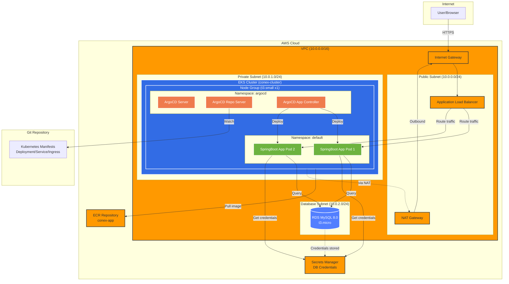

# About this repository
This repository is an example application for learning containerized applications. I want to learn the following technical skills:
- Amazon ECS/EKS
- Argo CD

# Architecture

## Architecture Components

### Network Layer (VPC Stack)
- **VPC**: 10.0.0.0/16 CIDR block across 1 Availability Zone
- **Public Subnet**: Hosts NAT Gateway and Application Load Balancer
- **Private Subnet**: Hosts EKS worker nodes with egress via NAT Gateway
- **Database Subnet**: Isolated subnet for RDS instance

### Database Layer (RDS Stack)
- **RDS MySQL 8.0**: t3.micro instance in isolated subnet
- **Secrets Manager**: Stores database credentials securely
- **Storage**: 20GB with auto-scaling up to 30GB (GP3)
- **Backup**: Disabled for cost optimization

### Container Orchestration (EKS Stack)
- **EKS Control Plane**: Managed Kubernetes 1.31
- **Node Group**: 1x t3.small instance (min: 1, max: 2)
- **Security**: Nodes in private subnet, controlled access to RDS

### Application Layer (Application Stack)
- **ECR Repository**: Stores Docker images with lifecycle policy (keep last 5 images)
- **Service Account**: IRSA-enabled account with access to Secrets Manager and ECR
- **ArgoCD**: GitOps deployment tool running in argocd namespace
- **SpringBoot App**: Java application running in default namespace

### Traffic Flow
1. User accesses application via Internet Gateway
2. Application Load Balancer routes traffic to SpringBoot pods
3. SpringBoot pods retrieve DB credentials from Secrets Manager
4. SpringBoot pods query RDS MySQL database
5. ArgoCD watches Git repository and deploys application updates

# Project Structure
This repository has two directories.
1. `app`: Application source code.
2. `infra`: CDK source code.

